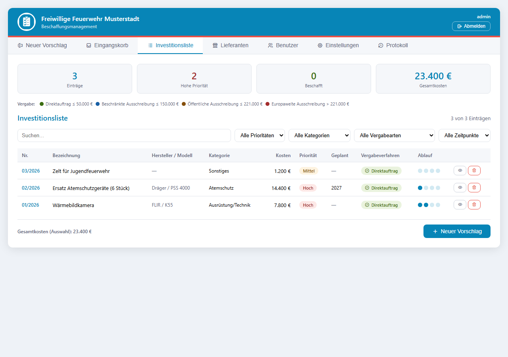
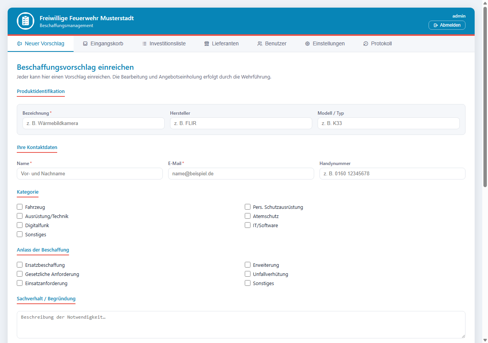
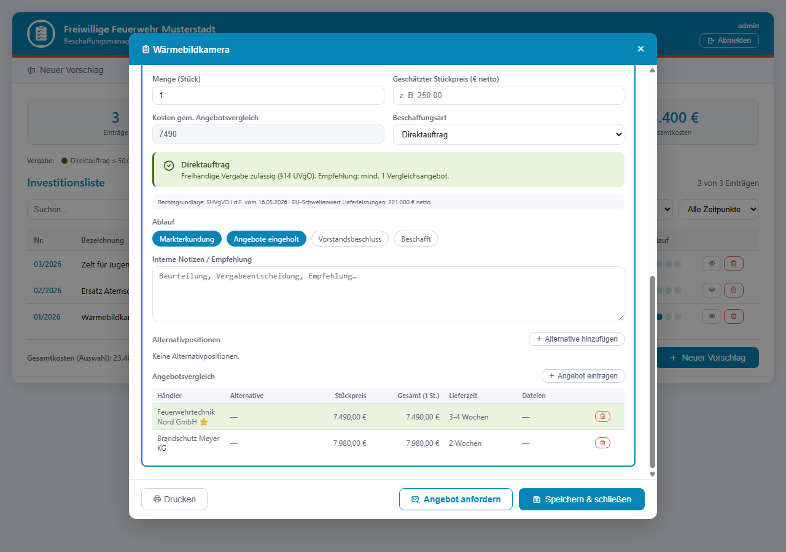

# Feuerwehr-Beschaffungstool

Ein schlankes, selbst gehostetes **Beschaffungsmanagement für Freiwillige Feuerwehren**:
Kameradinnen und Kameraden reichen Beschaffungsvorschläge über ein öffentliches Formular
ein, die Wehrführung prüft und genehmigt sie, holt Angebote ein und behält alles in einer
Investitionsliste mit Vergabe-Einstufung im Blick.



## Funktionen

- **Öffentliches Einreichungsformular** – jede*r kann Vorschläge einreichen (ohne Login),
  mit Kategorie, Anlass, Priorität, Kostenschätzung, PDF-Anhängen und frei
  konfigurierbaren Abteilungen
- **Eingangskorb** – Vorschläge prüfen, genehmigen oder mit Begründung ablehnen;
  Einreicher werden automatisch per E-Mail informiert
- **Investitionsliste** – genehmigte Beschaffungen mit Menge, Stückpreis, geplantem
  Beschaffungsjahr, Filterung und Druckansicht
- **Vergabe-Einstufung** – automatische Zuordnung zum Vergabeverfahren anhand
  konfigurierbarer Schwellenwerte (Voreinstellung: SHVgVO Schleswig-Holstein)
- **Angebotsanfragen per E-Mail** – Anfragen an Lieferanten direkt aus dem Tool
  (SMTP **oder** Microsoft 365 / Graph, ohne IMAP/SMTP-Freischaltung)
- **Automatischer Angebots-Import** – Antworten der Lieferanten (mit `[FF-Nr]` im
  Betreff) werden automatisch aus dem Postfach abgeholt, PDF-Angebote und
  Original-Mail landen direkt beim Vorgang
- **Angebotsvergleich** – Angebote inkl. Alternativprodukten gegenüberstellen,
  günstigstes Angebot wird markiert und in die Kosten übernommen
- **Rollen & Benutzer** – Betrachter, Beschaffer, Admin; E-Mail-Benachrichtigungen
  bei neuen Vorschlägen und Angeboten
- **Branding** – Name, Logo, Farben und alle Formular-Texte frei anpassbar
  (Standard: neutrale „Musterstadt"-Optik)
- **Audit-Protokoll** – wer hat wann was geändert (inkl. CSV-Export)
- **PWA** – „Zum Startbildschirm hinzufügen" auf dem Handy
- **Versionssystem** – Versionsanzeige in der App, Update-Hinweis für Admins

| Einreichungsformular | Angebotsvergleich |
|---|---|
|  |  |

## Installation (Docker, empfohlen)

Voraussetzungen: ein Server/NAS/Mini-PC mit [Docker](https://docs.docker.com/engine/install/)
inkl. Docker Compose.

**1. Verzeichnis anlegen und Dateien erstellen:**

```bash
mkdir feuerwehr-beschaffung && cd feuerwehr-beschaffung
```

`docker-compose.yml`:

```yaml
services:
  web:
    image: ghcr.io/nikc112/feuerwehr-beschaffungstool:latest
    ports:
      - "80:5000"
    volumes:
      - ./data:/app/data
    env_file:
      - .env
    restart: unless-stopped
```

`.env` (Vorlage: [.env.example](.env.example)) – Minimalfassung:

```bash
# Langen Zufallswert eintragen, z. B. Ausgabe von:  openssl rand -hex 32
SECRET_KEY=bitte-aendern-mit-langem-zufallswert

# Auf "true" setzen, sobald die App hinter HTTPS läuft (empfohlen)
COOKIE_SECURE=false
```

**2. Starten:**

```bash
docker compose up -d
```

**3. Einrichten:** `http://<server-adresse>` im Browser öffnen — beim ersten Aufruf
wird das **Admin-Konto** angelegt. Danach unter **Einstellungen**: Name/Logo/Farben,
E-Mail-Anbindung (SMTP oder Microsoft 365), Vergabe-Schwellen und Formular-Texte
anpassen.

Alle Daten (Datenbank, Uploads, Logo) liegen im Ordner `./data` — dieser Ordner ist
das Backup und sollte wie ein Geheimnis behandelt werden (enthält u. a. die
E-Mail-Zugangsdaten, siehe [docs/SECURITY.md](docs/SECURITY.md)).

### Update

```bash
docker compose pull && docker compose up -d
```

Admins sehen in den Einstellungen einen Hinweis, sobald eine neue Version verfügbar
ist. Details zu Versionen/Releases: [docs/RELEASE.md](docs/RELEASE.md).

## Konfiguration (Umgebungsvariablen)

| Variable | Standard | Beschreibung |
|---|---|---|
| `SECRET_KEY` | *(auto-generiert)* | Sitzungs-Schlüssel. In Produktion explizit setzen (langer Zufallswert). |
| `COOKIE_SECURE` | `false` | `true` sobald die App hinter HTTPS läuft (Secure-Cookies). |
| `TRUSTED_PROXIES` | `0` | Anzahl Reverse-Proxies davor (für echte Client-IP beim Rate-Limiting). |
| `DATA_DIR` | `/app/data` | Datenverzeichnis (im Container). |
| `SMTP_HOST/PORT/USER/PASSWORD/FROM/TLS` | – | SMTP-Versand; alternativ komplett in den App-Einstellungen konfigurierbar (auch Microsoft 365). |

Alles Weitere (E-Mail-Vorlagen, Abteilungen, Vergabe-Schwellen, Branding, Benutzer,
Abruf-Intervall) wird **in der App** unter *Einstellungen* konfiguriert.

## Entwicklung

```bash
git clone https://github.com/nikc112/feuerwehr-beschaffungstool.git
cd feuerwehr-beschaffungstool
python -m venv .venv && .venv/Scripts/activate   # Windows (Linux: source .venv/bin/activate)
pip install -r requirements.txt -r requirements-dev.txt

# Entwicklungsserver (SQLite in ./data)
python -c "import os; os.environ['DATA_DIR']='./data'; from app import create_app; create_app().run(port=5000, debug=True)"

# Tests
python -m pytest tests/ -q
```

## Weitere Dokumentation

- [docs/SECURITY.md](docs/SECURITY.md) – Sicherheitsmaßnahmen & Deployment-Hinweise
- [docs/RELEASE.md](docs/RELEASE.md) – Versionierung & Releases
- [docs/MICROSOFT365-SETUP.md](docs/MICROSOFT365-SETUP.md) – Microsoft 365 (Graph) einrichten

## Lizenz

[MIT](LICENSE) – frei nutzbar, auch für andere Feuerwehren und Vereine.
